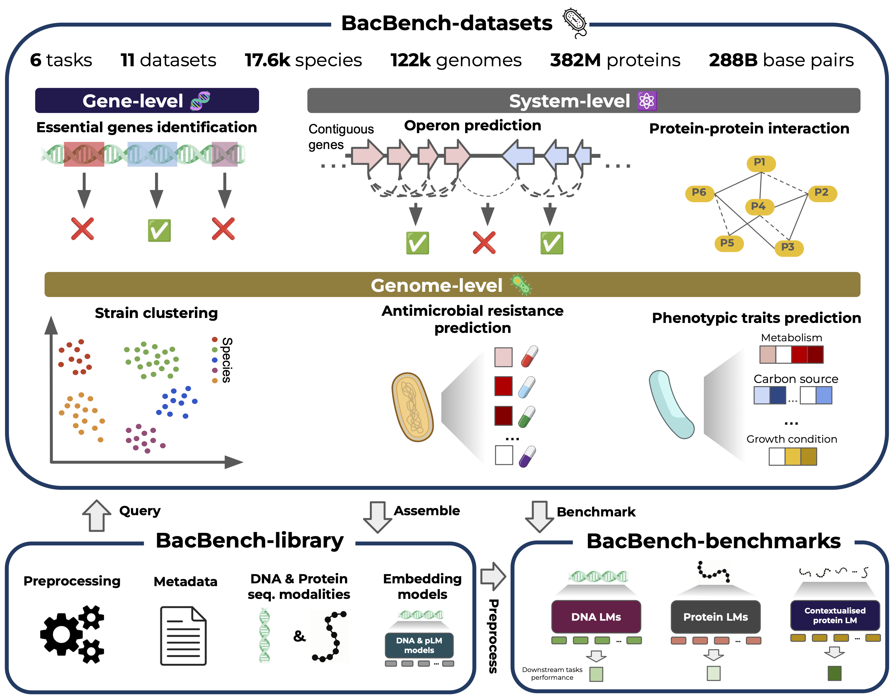

# BacBench

[](https://github.com/username/repo/blob/main/LICENSE)


[//]: # ([![Tests][badge-tests]][tests])

[//]: # ([![Documentation][badge-docs]][documentation])

[//]: # ()
[//]: # ([badge-tests]: https://img.shields.io/github/actions/workflow/status/macwiatrak/Bacformer/test.yaml?branch=main)

[//]: # ([badge-docs]: https://img.shields.io/readthedocs/Bacformer)


BacBench is a multi-scale and multi-task benchmark for evaluating ML models for bacterial genomics across the bacterial tree of life.
Currently BacBench includes 6 tasks which have been collected and curated from public databases: (1) essential genes prediction, (2) operon identification, (3) protein-protein interaction (PPI), (4) strain clustering, (5) antibiotic resistance prediction and (6) phenotypic traits prediction.

BacBench allows for embedding and evaluating genomes using various models (see [Benchmark models](#benchmarked-models) section),
as well as preprocessing bacterial genomes.



[//]: # (## News)

[//]: # ()
[//]: # (- **2025-05-15**: BacBench datasets are now available on [HuggingFace]&#40;https://huggingface.co/collections/macwiatrak/bacbench-6819ea4b0a226beef8d29f81&#41;.)

## Contents

- [Setup](#setup)
  - [Requirements](#requirements)
  - [installation](#installation)
- [Usage](#usage)
  - [Embedding genomes](#embedding-genomes)
  - [Model evaluation](#model-evaluation)
  - [Download and preprocess genomes](#download-and-preprocess-genomes)
- [Benchmark models](#benchmark-models)
- [Contributing](#contributing)
- [TO DOs](#to-dos)
- [Citation](#citation)
- [To-do-list](#to-do-list)
- [Contact](#contact)
- [Acknowledgements](#acknowledgements)

## Setup

### Requirements

BacBench uses [PyTorch](https://pytorch.org/), [HuggingFace Transformers](https://huggingface.co/docs/transformers/index), [PyTorch Lightning](https://lightning.ai/docs/pytorch/stable/)
and was developed in `python=3.10`.

To compute [ESM-2](https://github.com/facebookresearch/esm), [ESM-C](https://github.com/evolutionaryscale/esm), anc [Bacformer]() embeddings in a fast and efficient way, we leverage the [faplm](https://github.com/pengzhangzhi/faplm) package which requires [flash-attention](https://github.com/Dao-AILab/flash-attention).

We recommend using BacBench on a machine with 1) considerable disk space (for downloading datasets), 2) GPU (for embedding genomes and running some evaluations).


[//]: # (BacBench uses the open-source models available on HuggingFace as benchmark models and supports processing)

[//]: # (genomes in `gbff` &#40;i.e. [GenBank]&#40;https://www.ncbi.nlm.nih.gov/genbank/&#41;&#41;, `gff` and `fasta` formats.)

### Installation

[//]: # (You can install Bacbench using `pip`)

[//]: # (```bash)

[//]: # (pip install bacbench)

[//]: # (```)

Before installing BacBench, make sure to create a new `python` environment. We recommend using [mamba](https://mamba.readthedocs.io/en/latest/index.html), [conda](https://docs.conda.io/en/latest/) or [venv](https://docs.python.org/3/library/venv.html) to create a new environment.


You can install Bacbench by cloning the repository and installing the dependencies:
```bash
git clone https://github.com/macwiatrak/BacBench.git
cd BacBench
# 1) install BacBench **with its core dependencies**
pip install .
```
We also recommend to install the [faesm](https://github.com/pengzhangzhi/faplm) package which provides fast inference for ESM-2 and ESM-C models.

**Note**: Only install `faesm` on a machine with a GPU an CUDA installed.
```bash
# 2) (optional but recommended) add the fast‐attention extra (“faesm”)
pip install ".[faesm]"
```

## Usage

Below we describe how to access and use BacBench to:
1) Access the datasets.
2) Embed the genomes using various models.
3) Evaluate the models on distinct tasks.
4) Download and preprocess bacterial genomes.

[//]: # (### Datasets)

[//]: # (All of the datasets are available on [HuggingFace]&#40;https://huggingface.co/collections/macwiatrak/bacbench-6819ea4b0a226beef8d29f81&#41;.)

[//]: # ()
[//]: # (The datasets for essential genes prediction, operon identification, strain clustering, antibiotic resistance prediction)

[//]: # (and phenotypic traits prediction are available in both `DNA` and `protein sequence` modalities. Due to the size of the)

[//]: # (datasets, we recommend `streaming` the datasets unless you have a lot of disk space available. See examples below.)

[//]: # ()
[//]: # (```python)

[//]: # (from datasets import load_dataset)

[//]: # ()
[//]: # ()
[//]: # (# essential genes prediction task)

[//]: # (# protein sequences, size=59.2MB)

[//]: # (essential_genes_prot_seqs_ds = load_dataset&#40;"macwiatrak/bacbench-essential-genes-protein-sequences"&#41;)

[//]: # (# DNA sequences, size=92.2MB)

[//]: # (essential_genes_dna_seqs_ds = load_dataset&#40;"macwiatrak/bacbench-essential-genes-dna"&#41;)

[//]: # ()
[//]: # ()
[//]: # (# operon identification task)

[//]: # (# protein sequences, size=15.3MB)

[//]: # (operon_identification_prot_seqs_ds = load_dataset&#40;"macwiatrak/bacbench-operon-identification-protein-sequences"&#41;)

[//]: # (# DNA sequences, size=24MB)

[//]: # (operon_identification_dna_ds = load_dataset&#40;"macwiatrak/bacbench-operon-identification-dna"&#41;)

[//]: # ()
[//]: # ()
[//]: # (# protein-protein interaction &#40;PPI&#41; task)

[//]: # (# protein sequences, size=58.1GB)

[//]: # (# NOTE: as the labels are based on protein-protein interactions, we only include the protein sequences)

[//]: # (ppi_ds = load_dataset&#40;"macwiatrak/bacbench-ppi-stringdb-protein-sequences", streaming=True&#41;)

[//]: # ()
[//]: # ()
[//]: # (# strain clustering task)

[//]: # (# protein sequences, size=54.4GB)

[//]: # (strain_clustering_prot_seqs_ds = load_dataset&#40;"macwiatrak/bacbench-strain-clustering-protein-sequences", streaming=True&#41;)

[//]: # (# DNA sequences, size=81GB)

[//]: # (strain_clustering_dna_ds = load_dataset&#40;"macwiatrak/bacbench-strain-clustering-dna", streaming=True&#41;)

[//]: # ()
[//]: # ()
[//]: # (# antibiotic resistance prediction task)

[//]: # (# protein sequences, size=38.8GB)

[//]: # (ar_prot_seqs_ds = load_dataset&#40;"macwiatrak/bacbench-antibiotic-resistance-protein-sequences", streaming=True&#41;)

[//]: # (# DNA sequences, size=54.9GB)

[//]: # (ar_dna_ds = load_dataset&#40;"macwiatrak/bacbench-antibiotic-resistance-dna", streaming=True&#41;)

[//]: # ()
[//]: # ()
[//]: # (# phenotypic traits prediction task)

[//]: # (# protein sequences, size=36GB)

[//]: # (pheno_traits_prot_seqs_ds = load_dataset&#40;"macwiatrak/bacbench-phenotypic-traits-protein-sequences", streaming=True&#41;)

[//]: # (# DNA sequences, size=51.1GB)

[//]: # (pheno_traits_dna_ds = load_dataset&#40;"macwiatrak/bacbench-phenotypic-traits-dna", streaming=True&#41;)

[//]: # (```)

[//]: # ()
[//]: # (Dataset details including nr of genomes and more are available in the datasets cards on [HuggingFace]&#40;https://huggingface.co/collections/macwiatrak/bacbench-6819ea4b0a226beef8d29f81&#41;.)


### Embedding genomes

We provide extendable scripts to embed genomes at the gene and whole-genome level using various models.

Embedding genomes is the first step to evaluating the models on the tasks. We include details on how to embed
genomes for each task in the task-specific README files in the `bacbench/tasks/` directory.

Below, we show examples on how to embed genomes using the supported models on a few tasks.

**Note**: Running embedding scripts require GPU.

#### Essential genes prediction task
```bash
# embed and save the genomes using the ESM-C model
python bacbench/modeling/run_embed_prot_seqs.py \
    --dataset-name macwiatrak/bacbench-essential-genes-protein-sequences \
    --output-filepath <output-dir>/essential_genes_esmc_embeddings.parquet \
    --model-path esmc_300m \
    --batch-size 64

# embed and save the genomes using the Bacformer model
python bacbench/modeling/run_embed_prot_seqs.py \
    --dataset-name macwiatrak/bacbench-essential-genes-protein-sequences \
    --output-filepath <output-dir>/essential_genes_bacformer_embeddings.parquet \
    --model-path macwiatrak/bacformer-masked-complete-genomes \
    --batch-size 64 \
    --max-n-proteins 9000  # max nr of proteins in a genome

# embed and save the genomes using the Nucleotide Transformer model
python bacbench/modeling/run_embed_dna.py \
    --dataset-name macwiatrak/bacbench-essential-genes-dna \
    --output-filepath <output-dir>/essential_genes_nt_embeddings.parquet \
    --model-path InstaDeepAI/nucleotide-transformer-v2-250m-multi-species \
    --batch-size 128 \
    --max-seq-len 2048 \
    --dna-seq-overlap 32  # overlap between the sequences when the gene length is higher than --max-seq-len, default value
```

#### Operon identification task
```bash
# embed and save the genomes using the ProtBert model
python bacbench/modeling/run_embed_prot_seqs.py \
    --dataset-name macwiatrak/bacbench-operon-identification-protein-sequences \
    --output-filepath <output-dir>/operon_identification_protbert_embeddings.parquet \
    --model-path Rostlab/prot_bert  \
    --batch-size 64

# embed and save the genomes using the Bacformer model
python bacbench/modeling/run_embed_prot_seqs.py \
    --dataset-name macwiatrak/bacbench-operon-identification-protein-sequences \
    --output-filepath <output-dir>/operon_identification_bacformer_embeddings.parquet \
    --model-path macwiatrak/bacformer-masked-complete-genomes \
    --batch-size 64 \
    --max-n-proteins 9000  # max nr of proteins in a genome, default value


# embed and save the genomes using the Mistral-DNA model
python bacbench/modeling/run_embed_dna.py \
    --dataset-name macwiatrak/bacbench-operon-identification-dna \  # name of the dataset
    --output-filepath <output-dir>/operon_identification_mistral_embeddings.parquet \
    --model-path Raphaelmourad/Mistral-DNA-v1-138M-bacteria \
    --batch-size 256 \
    --max-seq-len 512 \
    --dna-seq-overlap 16
```

#### Strain clustering task
```bash
# embed and save the genomes using the ESM-2 model
python bacbench/modeling/run_embed_prot_seqs.py \
    --dataset-name macwiatrak/bacbench-strain-clustering-protein-sequences \
    --output-filepath <output-dir>/strain_clustering_esm2_embeddings.parquet \
    --model-path facebook/esm2_t12_35M_UR50D \
    --batch-size 64 \
    --genome-pooling-method mean \
    --streaming

# embed and save the genomes using the Bacformer model
python bacbench/modeling/run_embed_prot_seqs.py \
    --dataset-name macwiatrak/bacbench-strain-clustering-protein-sequences \
    --output-filepath <output-dir>/strain_clustering_bacformer_embeddings.parquet \
    --model-path macwiatrak/bacformer-masked-complete-genomes \
    --batch-size 64 \
    --genome-pooling-method mean \
    --streaming \
    --max-n-proteins 9000  # max nr of proteins in a genome, default value


# embed and save the genomes using the Nucleotide Transformer model
python bacbench/modeling/run_embed_dna.py \
    --dataset-name macwiatrak/bacbench-strain-clustering-dna \
    --output-filepath <output-dir>/strain_clustering_nucleotide_transformer_embeddings.parquet \
    --model-path InstaDeepAI/nucleotide-transformer-v2-250m-multi-species \
    --batch-size 128 \
    --max-seq-len 2048 \
    --dna-seq-overlap 32 \
    --agg-whole-genome \
    --streaming
```

**Note**: DNABERT-2 requires specific requirements, to install them please refer to [DNABERT-2 github](https://github.com/MAGICS-LAB/DNABERT_2).

**Embedding slices of the dataset**: We also provide functionality to embed only a slice of the dataset, which is useful for testing and debugging.
To use it just use the `--start-idx` and `--end-idx` arguments to specify the slice of the dataset you want to embed.
Both `run_embed_dna.py` and `run_embed_prot_seqs.py` scripts support this functionality.

See [Benchmark models](#benchmarked-models) section for the list of currently supported models.

### Model evaluation
We provide scripts to evaluate the embeddings models for each task in the `bacbench/tasks/` directory.
We include details on how to evaluate models for each task in the task-specific README files in the `bacbench/tasks/` directory.

Below, we show examples on how to evaluate the models using embedded data.

**Note**: to run evaluation scripts, you need to have the embeddings saved in a parquet file (see above examples for how to embed the genomes).

#### Essential genes prediction task
```bash
python bacbench/tasks/essential_genes/run_train_cls.py \
    --input-df-filepath <input-dir>/essential_genes_esmc_embeddings.parquet \
    --output-dir <output-dir> \
    --lr 0.005 \
    --max-epochs 100 \
    --model-name esmc
```

#### Operon identification task
```bash
python bacbench/tasks/operon/run_evaluation_operondb.py \
    --input-df-filepath <input-dir>/operon_identification_bacformer_embeddings.parquet \
    --output-dir <output-dir> \
    --model-name bacformer
````

#### Strain clustering task
```bash
python bacbench/tasks/strain_clustering/run_evaluation_operondb.py \
    --input-df-filepath <input-dir>/strain_clustering_esm2_embeddings.parquet \
    --output-dir <output-dir> \
    --model-name bacformer
````

For more details on how to run the evaluation scripts, please refer to the scripts in the `bacbench/tasks/` directory.

### Download and preprocess genomes

To make it easier to download and preprocess genomes, we provide functionality as part of the `bacbench` package to
(i) download genomes from NCBI/GenBank and (ii) preprocess them to the required format for the models. See examples below.

```python
from bacbench.pp import (
    extract_protein_info_from_gbff,
    extract_protein_info_from_gff,
    extract_dna_info_from_fna,
    download_and_process_genome_by_taxid,
    download_and_process_genome_by_assembly_id,
)

# given an GBFF file, extract the protein sequences and their annotations
# for example, we can use the Pseudomonas aeruginosa PAO1 genome = https://www.ncbi.nlm.nih.gov/datasets/genome/GCF_000006765.1/
genome_protein_seqs_df = extract_protein_info_from_gbff("<input-dir>/GCF_000006765.1.gbff")
# given a GFF file, extract the protein info
genome_protein_info_df = extract_protein_info_from_gff("<input-dir>/GCF_000006765.1.gff")
# given a FNA file, extract the DNA sequences
genome_dna_seqs_df = extract_dna_info_from_fna("<input-dir>/GCF_000006765.1_ASM676v1_genomic.fna")

# we also provide functionality to download and preprocess genomes from NCBI/GenBank
# download and preprocess a genome by its taxid
taxid_df = df = download_and_process_genome_by_taxid(
    taxid=208964,  # taxid for Pseudomonas aeruginosa PAO1
    file_type="gbff",
)
# download and preprocess a genome by its assembly id
assembly_id_df = download_and_process_genome_by_assembly_id(
    assembly_id="GCF_000006765.1",
    file_type="gbff",
)
```


## Benchmarked models

We currently support the following models:

| Model                  | Input                               | Variant / Checkpoint                                                                                                            | Objective      | Params | dim   | Max context |
|------------------------|-------------------------------------|---------------------------------------------------------------------------------------------------------------------------------|----------------|--------|-------|-------------|
| Mistral-DNA            | DNA                                 | [Mistral-DNA-v1-138M-bacteria](https://huggingface.co/RaphaelMourad/Mistral-DNA-v1-138M-bacteria)                               | Autoregressive | 138 M  | 768   | 512         |
| DNABERT-2*             | DNA                                 | [DNABERT-2-117M](https://huggingface.co/zhihan1996/DNABERT-2-117M)                                                              | Masked         | 117 M  | 768   | 512         |
| Nucleotide Transformer | DNA                                 | [nucleotide-transformer-v2-250m-multi-species](https://huggingface.co/InstaDeepAI/nucleotide-transformer-v2-250m-multi-species) | Masked         | 27 M   |       | 2 048       |
| ProkBERT               | DNA                                 | [prokbert-mini-long](https://huggingface.co/neuralbioinfo/prokbert-mini-long)                                                   | Masked         | 250 M  | 384   | 4 096       |
| Evo                    | DNA                                 | [evo-1-8k-base (1.1_fix)](https://huggingface.co/togethercomputer/evo-1-8k-base)                                                | Autoregressive | 6.5 B  | 4 096 | 8 192       |
| ESM-2                  | Single protein seq.                 | [esm2_t12_35M_UR50D](https://huggingface.co/facebook/esm2_t12_35M_UR50D)                                                        | Masked         | 35 M   | 480   | 1 024       |
| ESM-C                  | Single protein seq.                 | [esmc_300m](https://huggingface.co/EvolutionaryScale/esmc-300m-2024-12)                                                         | Masked         | 300 M  | 960   | 1 024       |
| ProtBert               | Single protein seq.                 | [prot_bert](https://huggingface.co/Rostlab/prot_bert)                                                                           | Masked         | 420 M  | 1 024 | 1 024       |
| gLM2                   | Mixed modality (DNA & protein seq.) | [gLM2 650M](https://huggingface.co/tattabio/gLM2_650M)                                                                           | Masked         | 650 M  | 1 280 | 4 096       |
| Bacformer              | Multiple protein seq.               | [bacformer-masked-complete-genomes](https://huggingface.co/macwiatrak/bacformer-masked-complete-genomes)***                     | Masked         | 27 M   | 480   | 6 000       |

`*` DNABERT-2 requires specific requirements, to install them please refer to [DNABERT-2 github](https://github.com/MAGICS-LAB/DNABERT_2).

`***` For strain clustering we used [bacformer-masked-complete-genomes](https://huggingface.co/macwiatrak/bacformer-masked-MAG) as the input are
metagenome-assembled genomes (MAGs), rather than complete genomes.


## Contributing

We welcome contributions to BacBench! If you would like to contribute, please follow these steps:
1. Fork the repository.
2. Install `pre-commit` and set up the pre-commit hooks (make sure to do it at the root of the repository).
```bash
pip install pre-commit
pre-commit install
```
2. Create a new branch for your feature or bug fix.
3. Make your changes and commit them.
4. Push your changes to your forked repository.
5. Create a pull request to the main repository.
6. Make sure to add tests for your changes and run the tests to ensure everything is working correctly.

## Citation

> t.b.a

## To-do-list

- [ ] Publish to pypi
- [ ] Create model leaderboard for each task
- [ ] Add support for adding new models to the benchmark
- [ ] Add dataset details to the repository
- [ ] Add support for batch downloading genomes from NCBI/GenBank

## Contact

For questions, bugs, and feature requests, please raise an issue in the repository.

## Acknowledgements

We sincerely thank the authors of following open-source projects:

- [datasets](https://github.com/huggingface/datasets)
- [transformers](https://github.com/huggingface/transformers)
- [FAPLM](https://github.com/pengzhangzhi/faplm)
- [flash-attention](https://github.com/HazyResearch/flash-attention)
